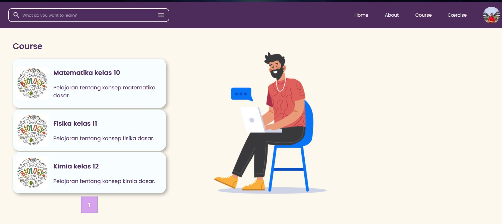
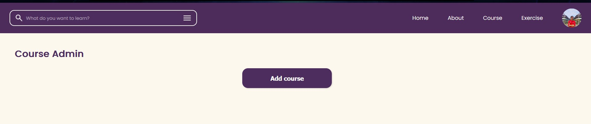
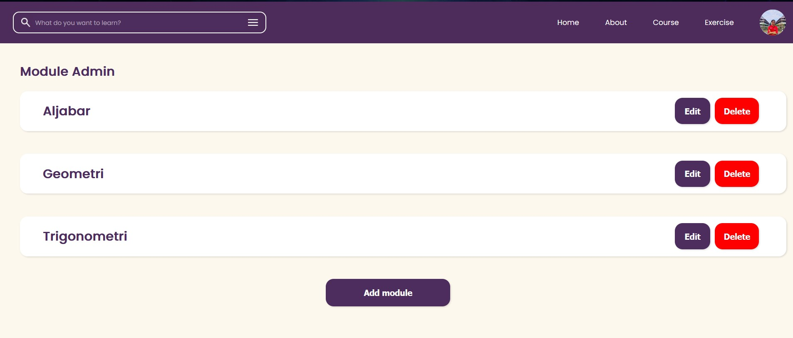
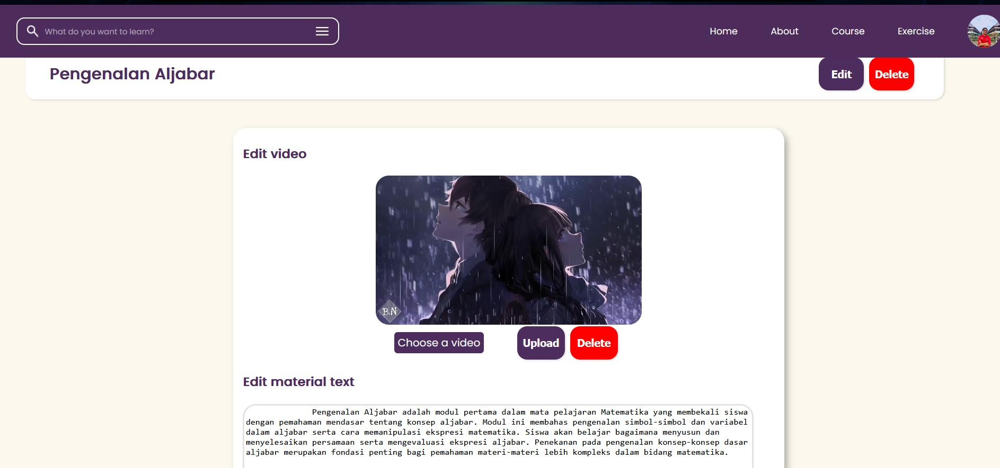
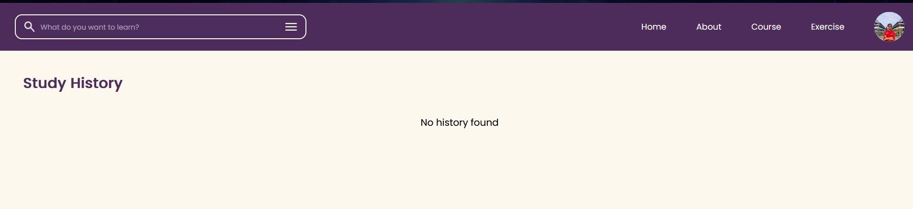
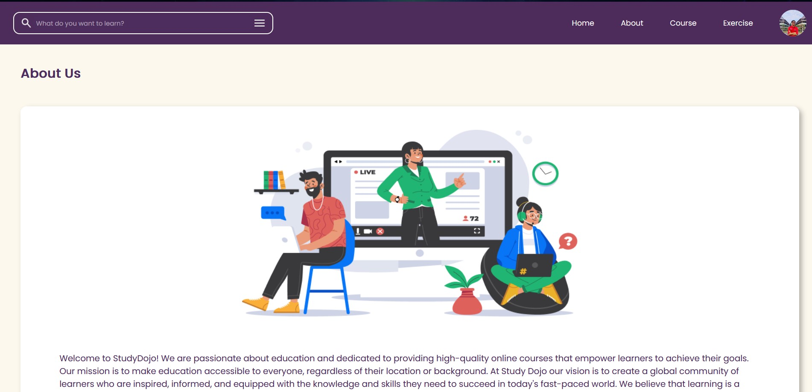

<a name="readme-top"></a>
<br />

<div align="center">
  <a href="https://github.com/IF3110-2023-02-42/PHP">
  </a>

  <h3 align="center">StudyDojo</h3>

  <p align="center">
    Platform Online Course untuk Siswa SMA<br>
</div>

<!-- TABLE OF CONTENTS -->
<details>
  <summary>Table of Contents</summary>
  <ol>
    <li>
      <a href="#about-the-project">About The Project</a>
      <ul>
        <li><a href="#built-with">Built With</a></li>
      </ul>
    </li>
    <li>
      <a href="#getting-started">Getting Started</a>
      <ul>
        <li><a href="#dependencies">Dependencies</a></li>
        <li><a href="#prerequisites">Prerequisites</a></li>
        <li><a href="#installation">Installation</a></li>
      </ul>
    </li>
    <li><a href="#changes">Changes</a></li>
    <li><a href="#usage">Usage</a></li>
    <li><a href="#contributions">Contributions</a></li>
    <li><a href="#contact">Contact</a></li>
  </ol>
</details>

<!-- ABOUT THE PROJECT -->

## About The Project

Studydojo

<p align="right">(<a href="#readme-top">back to top</a>)</p>

### Built With

- HTML
- CSS
- Javascript
- PHP

<p align="right">(<a href="#readme-top">back to top</a>)</p>

<!-- GETTING STARTED -->

## Getting Started

Tanpa Berlama-lama inilah cara menjalankan web app

### Prerequisites

- Docker
  ```sh
  https://www.docker.com/
  ```
- Git
  ```sh
  https://git-scm.com/downloads
  ```

### Installation

1. Clone Repo ini dengan menggunakan cmd pada directory yang diinginkan
   ```sh
   C:\Users\MerekLaptop>
   git clone https://github.com/IF3110-2023-02-42/PHP
   ```
2. Buka Directory tempat file di clone
   ```sh
   C:\Users\MerekLaptop> cd tugas-besar-1
   C:\Users\MerekLaptop\tugas-besar-11>
   ```
3. Jalankan docker
   ```sh
   C:\Users\MerekLaptop\tugas-besar-1>
   docker-compose up -d
   ```
4. buka http://localhost:8080 di browser favorit kalian
5. StudyDojo siap untuk dipakai

<!-- USAGE EXAMPLES -->

## Usage

1. Home
   

2. Course Admin
   

3. Module Admin
   

4. Material Admin
   

5. Exercise Admin
   

6. Study History
   

7. Course
   

8. Module
   

9. Material
   

10. Profile
    

11. About Us
    

<!-- CONTRIBUTING -->

## Contributions

- Front-end Tambahan
  - Fitur request verifikasi : 13521106
  - Fitur buka halaman premium : 13521106
  - Fitur halaman bookmark material : 13521051
  - Fitur redirect material to exercise : 13521051
- Back-end Tambahan
  - Fitur request verifikasi : 13521106
  - Fitur menunjukkan status verifikasi : 13521106
  - Fitur tambah bookmark : 13521051

<p align="right">(<a href="#readme-top">back to top</a>)</p>

<!-- CONTACT -->

## Contact

| Name                        | Contact                     | Github                                                              |
| --------------------------- | --------------------------- | ------------------------------------------------------------------- |
| Manuella Ivana Uli Sianipar | 13521051@std.stei.itb.ac.id | <a href="https://www.github.com/manuellaiv">@manuellaiv</a>         |
| Muhammad Fadhil Amri        | 13521066@std.stei.itb.ac.id | <a href="https://www.github.com/Mehmed13">@Mehmed13</a>             |
| Mohammad Farhan Fahrezy     | 13521106@std.stei.itb.ac.id | <a href="https://www.github.com/farhanfahreezy">@farhanfahreezy</a> |

<p align="right">(<a href="#readme-top">back to top</a>)</p>
